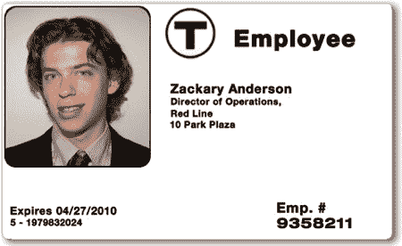

# MBTA 放弃对麻省理工学院地铁黑客的诉讼

> 原文：<https://hackaday.com/2008/12/23/mbta-drops-lawsuit-against-mit-subway-hackers/>

马萨诸塞州海湾运输管理局(MBTA)已经撤销了对三名麻省理工学院研究人员“地铁黑客”的联邦诉讼。这发生在 10 月，现在 EFF 带来消息，学生们将与 MBTA 一起改进他们的系统。总体目标是提高安全性，同时保持费用最低。

整个混乱始于 8 月份，当时针对学生在 Defcon 上的陈述发布了一项禁言令。很遗憾没有人看到它，因为它涵盖了很多有趣的领域。被禁幻灯片的 [PDF 仍然在线。他们对地铁的收费系统和物理安全进行了几次攻击。到目前为止，我们最喜欢的是使用](http://www-tech.mit.edu/V128/N30/subway/Defcon_Presentation.pdf) [GNU Radio](http://www.gnu.org/software/gnuradio/ "GNU Radio - GNU FSF Project") 来嗅探 RFID 卡的交易，并用 FPGA 来强行使用 [Mifare Classic](http://hackaday.com/2008/01/01/24c3-mifare-crypto1-rfid-completely-broken/ "24C3 Mifare crypto1 RFID completely broken  - Hack a Day") 。