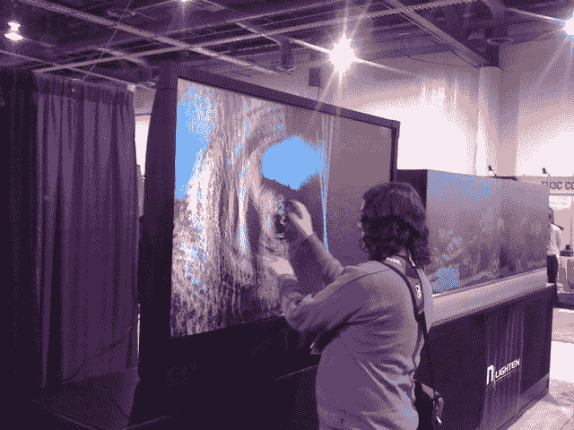

# 多点触控

> 原文::1230【https://hacked ay . com/2010/01/08/ces-多点触控/

这里可以看到【Devlin】在玩多点触控设置。我们检查了它，发现四个激光器，位于角落里。我们很确定我们以前见过这个[的精确设置](http://hackaday.com/2009/02/15/rear-projection-tv/)。那里没有太多的摊位，所以我们玩了会儿电视，然后继续前进。

我们还碰到一个 Hack A Day 的读者，完全忘了给他拍照。抱歉，如果你再碰到我们，我们会抓到你的。