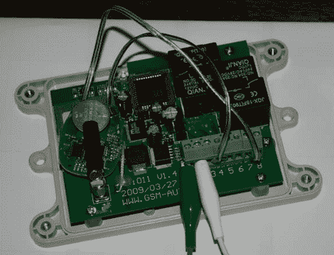

# GSM 汽车起动机

> 原文：<https://hackaday.com/2010/01/15/gsm-car-starter/>

这里刚刚开始暖和起来，但是很长一段时间都很冷。当气温远低于冰点时，我们不喜欢去任何地方，但那些职业隐士的机会从未实现，所以我们被困在寒冷中。受够了他冰冷的汽车，[亚伦]安装了一个远程启动装置，在他到达汽车前预热汽车。这在工作中没有帮助，因为从他的办公室到相当大的停车场的距离对于钥匙链的信号来说太远了。他决定[让他的启动器与 GSM 一起工作，这样他就可以用一个电话](http://sites.google.com/site/vehicleremotestarterextender/)来启动汽车。

第一次尝试涉及一部 30 美元的预付费手机。问题是打电话的人最终会发动汽车。经过一番寻找，他发现了一个 GSM 开关，只需要一个激活的 SIM 卡就可以工作。当被呼叫时，它读取来电号码进行认证，但从不拿起电话，所以没有使用分钟。他打开一个额外的钥匙链，把锁和启动按钮连接到 GSM 开关的继电器上。嘭！一个电话启动(并锁定)了他的车。

也许这不像身体植入那么难，但这是一个相当干净的解决方案。他使用汽车的 12v 系统为开关供电，并每三个月支付 10 美元来保持 SIM 卡的活动状态。广告之后是一个平淡无奇的演示视频，显示了一个手机呼叫和一辆汽车启动。

 <https://www.youtube.com/embed/gSNA_boPCEI?version=3&rel=1&showsearch=0&showinfo=1&iv_load_policy=1&fs=1&hl=en-US&autohide=2&wmode=transparent>

 </body> </html>