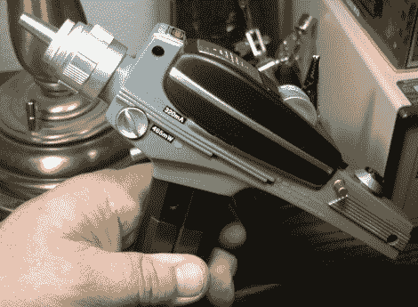

# 相位器到激光模块输出 465 毫瓦

> 原文：<https://hackaday.com/2010/01/15/phaser-to-laser-mod-puts-out-465mw/>

这是另一个[星际旅行相位器玩具，增加了一个激光](http://laserpointerforums.com/f51/tutorial-12x-star-trek-phaser-mod-46886.html)。[Jay]从 1994 年的星际迷航移相器开始，增加了一个 12X 蓝光二极管。玩具的声音效果仍然有效，休息后你可以在视频中看到这一点。该视频显示他用激光爆气球，这一壮举是由二极管以 320 mA 的电流驱动时产生的 465 mW 功率实现的。他为武器做了一个很好的手提箱，但是我们没有看到像我们在[其他 phaser hacks](http://hackaday.com/2009/11/12/set-phasers-to-blind/) 中看到的那样有一个保护眼镜的地方。他确实做了一个安全考虑，增加了一个安全开关和指示灯 LED，以便在激光二极管启动时发出信号。

 <https://www.youtube.com/embed/7S71mPJ0F0Q?version=3&rel=1&showsearch=0&showinfo=1&iv_load_policy=1&fs=1&hl=en-US&autohide=2&wmode=transparent>

 </body> </html>