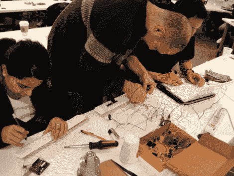

# 为门外汉开发物理控制器

> 原文：<https://hackaday.com/2010/01/16/developing-physical-controllers-for-the-uninitiated/>

[Dave]在伊利诺伊理工学院主持了一个为期一天的研讨会，重点是为那些以前没有什么经验的人提供快速电子原型制作。作为新手原型的事实标准，他给每个团队一个 Arduino 作为控制器-计算机接口也就不足为奇了。他以启动并运行 [Firmata 软件包](http://www.firmata.org/wiki/Main_Page)开始了这一天。Firmata 是一组库，使软件和微控制器之间的通信变得简单。在这种情况下，每个团队开发一个 Flash 游戏，使用 Arduino 的数据作为控制。

那天产生了几个初步的游戏。休息之后我们嵌入了其中两人的视频供您欣赏。狮子大战猪使用电位计、距离传感器和街机按钮来玩一个[猫捉老鼠](http://en.wikipedia.org/wiki/Cat_and_mouse)的游戏(嗯，真的是狮子和猪)。另一个是 Kick the Cat，这是一个使用 flex 传感器和力传感器组合作为输入的游戏。这是一种虚拟迷你篮球游戏，使用弹性材料发射虚拟猫科动物攻击目标。

这些团队已经有了代码方面的背景，但是硬件对他们来说是一个新的尝试。Arduino 有助于打破这种交叉障碍，我们认为这将导致更多的人为开源项目做出贡献，并由于更大的需求量而降低硬件价格。

<https://player.vimeo.com/video/8542167>

 
狮子大战猪
 
<iframe src="https://player.vimeo.com/video/8542148" width="800" height="480" frameborder="0" webkitallowfullscreen="" mozallowfullscreen="" allowfullscreen=""/>
 
踢猫
 </body> </html>