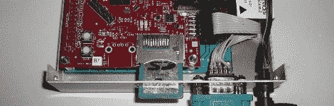

# 黑客日链接:2010 年 1 月 17 日

> 原文：<https://hackaday.com/2010/01/17/hackaday-links-january-17th-2010/>

**Windows 上的苹果魔鼠**

看起来有些人窥探了苹果公司最新的蓝牙更新，[设法提取了神奇的鼠标驱动程序](http://uneasysilence.com/archive/2009/11/14588/)。现在你可以用它们带着这个[复杂的外设](http://hackaday.com/2009/10/22/magic-mouse-and-macbook-teardowns/)在 Windows 上转一圈。[谢谢胡安]

**组件首饰:从极客到恶心**

[Nikolaus]为他的妻子制作了一对 30 万欧姆的耳环。每只耳朵有三个棕黑黄电阻。这很怪，但是很微妙。比另一个家伙的[愚蠢的乳头实验](http://afrotechmods.com/groovy/Ghetto_piercings/LED_nipple_ring.htm)的总结果要精致得多。需要把乳头首饰的形象从你的脑海中抹去吗？[Nikolaus]你是否戴了一些 [3d 打印耳环](http://www.local-guru.net/blog/2009/12/22/3d-printer-earrings)。

**GTK GPS**

需要你的 GPS 数据精确到一厘米以内？我们也没有，但如果你有，实时动态 GPS 是你需要的。现在你可以使用 RTLIB 包自己构建一个。这是基于[强大而廉价的猎兔犬板](http://hackaday.com/2009/10/30/xbmc-running-on-arm/)。[谢谢简]

**
**

**杂乱的音乐**

本周这里变暖了一点，天气变得泥泞不堪。我们的套鞋很好，不透水，但是(大卫的)在侧面有一个大洞，里面装满了一个迷你键盘。他选择了一个橡胶靴作为电路弯曲项目的外壳。这是一个很好的触摸，[隐藏的按键仍然可以通过弹性橡胶播放](http://www.youtube.com/watch?v=m1wk0ywEWv8)。