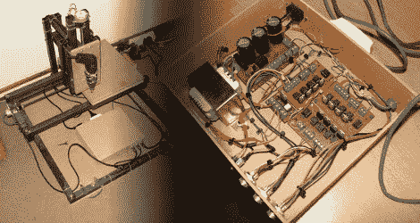

# 拉链带给你的 CNC

> 原文：<https://hackaday.com/2010/01/17/cnc-brought-to-you-by-zip-ties/>

[lucassiglo21]让我们了解一下他完成的 [3 轴数控](http://elcoyotequesuelda.blogspot.com/search/label/cnc) ( [通过谷歌翻译](http://translate.google.com/translate?js=y&prev=_t&hl=en&ie=UTF-8&layout=1&eotf=1&u=http%3A%2F%2Felcoyotequesuelda.blogspot.com%2Fsearch%2Flabel%2Fcnc&sl=auto&tl=en))。虽然[家庭 CNC](http://hackaday.com/?s=cnc)并不新鲜，但我们真的很喜欢这个杰作。CNC 是完全定制的，从电子控制板(通过并行端口连接到 PC)到物理轧机(最终结果是 30x30x15cm 的可工作区域)。我们最喜欢的部分是使用螺丝/带夹拉链来固定 Dremel——这是黑客极客的真实展示。对于之前没见过数控钻一圈的(老实说，谁没见过？)，休息后查个视频。

 <https://www.youtube.com/embed/52GxAz3rqcg?version=3&rel=1&showsearch=0&showinfo=1&iv_load_policy=1&fs=1&hl=en-US&autohide=2&wmode=transparent>

 </body> </html>