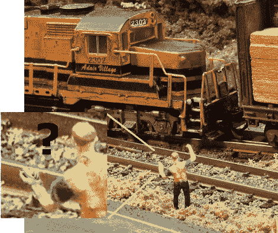

# Wii 双截棍火车控制

> 原文：<https://hackaday.com/2010/01/18/wii-nunchuk-train-controls/>

虽然我们一直被告知我们的生活 Wii 和火车只是不能混合，他们从来没有说过任何关于 Wii 双截棍。一个被滥用的笑话之后，[肯]向我们透露了他的 Wii 双节棍控制的火车套装。

通过利用 Arduino 的[数字命令控制](http://en.wikipedia.org/wiki/Digital_Command_Control)(想想脉宽调制)，他能够完全控制火车的方向和速度。等式的另一部分是 Wii 双截棍和[适配器](http://todbot.com/blog/2008/02/18/wiichuck-wii-nunchuck-adapter-available/)。设置应该是非常简单明了的，但是对于那些需要更多帮助的人来说,[是一个有指导意义的](http://www.instructables.com/id/Wii-Nunchuk-Controlled-Model-Train/)。