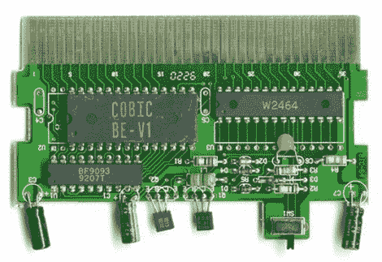

# NES 控制台到墨盒深度安全

> 原文：<https://hackaday.com/2010/01/20/nes-console-to-cartridge-security-in-depth/>

[Segher]对 NES CIC 芯片的硬件和命令集进行了逆向工程。这些芯片构成了验证盒式磁带的安全硬件，以确保它得到了任天堂的许可。只有在认证之后，控制台的 CIC 芯片才会停止以 1 Hz 重置硬件。这些芯片没有可用的硬件信息(见图)，所以[Segher]不得不用手边的工具做一些调查，包括一些来自芯片对的 rom 转储。他很友好地和我们分享了他的发现。我们打赌它们对你没有多大用处，但我们发现这是一本有趣的读物。

[感谢 ppcasm]

[图片鸣谢:[打鸡蛋做煎蛋](http://multimedia.cx/eggs/rom-images/)