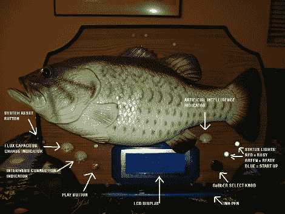

# 带可选剪辑的 Billy Bass

> 原文：<https://hackaday.com/2010/01/20/billy-bass-with-selectable-clips/>

[威尔]喜欢把破解的物品作为秘密圣诞礼物送给别人，今年[他决定增加一个比利·巴斯](http://thesecretsanta2009.blogspot.com/)。这些插科打诨的东西已经成为[用来做道具](http://hackaday.com/2009/10/06/halloween-prop-bigmouth-billy-bass/)或者[给你读你的推特更新](http://hackaday.com/2009/09/24/twitter-talking-fish-and-more/)的一种流行黑客手段。蝙蝠的权利，他报废了原来的印刷电路板，并将其发送给礼物的未来收件人，就好像他是一个绑架勒索一个家庭。然后，他开始用一对 PIC 18F452 微控制器来代替内脏。一个使用功率晶体管来控制运动，另一个控制 MP3 来处理声音剪辑。该界面有一些发光二极管以增加效果，并使用一个转盘来选择每个声音剪辑，这些剪辑显示在 4×20 字符的 LCD 上。

该项目有几个令人头疼的电压问题，因为电机在 6v 和 4v 下工作，微控制器和 LCD 显示器在 5v 下工作，而 MP3 正在寻找 1.5v 的电压。这是为这个科学怪人[原理图](http://i246.photobucket.com/albums/gg94/gigavolt/Pics/hacks/SS09/SS09.png)提供的电压。但他成功了，正如你在休息后的视频中看到的。

[https://www.youtube.com/embed/1ZXQrOQ1In0?version=3&rel=1&showsearch=0&showinfo=1&iv_load_policy=1&fs=1&hl=en-US&autohide=2&wmode=transparent](https://www.youtube.com/embed/1ZXQrOQ1In0?version=3&rel=1&showsearch=0&showinfo=1&iv_load_policy=1&fs=1&hl=en-US&autohide=2&wmode=transparent)