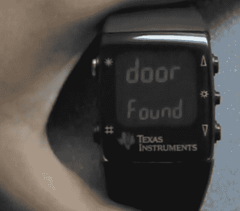

# 用你的手表输入密码

> 原文：<https://hackaday.com/2010/01/21/coded-entry-using-your-wristwatch/>

[晏子]和[扎克]建立了一个[门禁系统，使用从你的手表](https://ziyan.info/2010/01/secure-wireless-door-lock/)输入的密码。他们使用的是我们在 11 月份看到的 [TI eZ-430 Chronos](http://hackaday.com/2009/11/25/ti-sports-watch-for-hacking/) 。有一个项目盒安装在锁舌杆上。在内部，无线遥控器等待手表连接。当手表已经连接并且接收到正确的代码(使用 128 位加密)时，遥控钥匙启动伺服机构来转动锁。在用户方面，通过点击手表来输入代码。内置加速度计拾取这些敲击声，并将它们传递给门单元。

这是一项了不起的工程！休息之后看看他们的演示视频。我们希望看到万一门单元失灵时逃离公寓的机械选择，但我们认为这是完美的。我们期待看到更多利用 TI 硬件的项目。

 <https://www.youtube.com/embed/yqMbdQptdfw?version=3&rel=1&showsearch=0&showinfo=1&iv_load_policy=1&fs=1&hl=en-US&autohide=2&wmode=transparent>

 </body> </html>