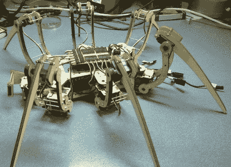

# 蜘蛛机器人引发激光嫉妒

> 原文：<https://hackaday.com/2010/01/21/spiderbot-prompts-laser-envy/>

可怕的六足动物让我们希望我们坐在激光切割机旁边。这些零件是从 4.9 毫米的胶合板上切割下来的，包括激光雕刻的部分，以允许二十个伺服系统正确地安装在它们的安装空间中。我们建议你秘密建造它，这样当你的室友回家发现它在房间里嬉戏时，就不会破坏这个惊喜。

遗憾的是，我们找不到这个动作的视频，但是如果静态照片不够好的话,[去看看另一个六足动物](http://hackaday.com/2010/01/18/the-polulu-3-servo-hexapod/)。给派对增加了两条腿，你会看到 ABS 磨出的 [8 条腿蜘蛛](http://www.thingiverse.com/thing:585)断裂后的视频。

[https://www.youtube.com/embed/gNXuzhop-u8?version=3&rel=1&showsearch=0&showinfo=1&iv_load_policy=1&fs=1&hl=en-US&autohide=2&wmode=transparent](https://www.youtube.com/embed/gNXuzhop-u8?version=3&rel=1&showsearch=0&showinfo=1&iv_load_policy=1&fs=1&hl=en-US&autohide=2&wmode=transparent)