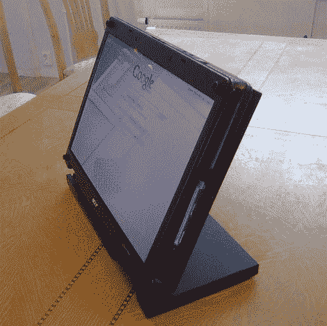

# 简单的笔记本电脑转换

> 原文：<https://hackaday.com/2010/01/22/simple-laptop-conversion/>

[Jakob]提交了他处理损坏的笔记本电脑铰链的方法。铰链断裂是一种灾难。我们至少有 4 台笔记本电脑因转轴损坏而无法修复。有些只是靠着东西支撑着，[有些上面粘着盒子铰链](http://thereifixedit.com/2009/12/31/laptop-budget-on-a-sliding-scale/)还有一些只是在等着因为不用而慢慢死去。[雅各布]有一个很好的整洁的转换，他基本上做了一个平板电脑。我们以前见过这种情况，也见过相框。他的版本，虽然很可能比大多数其他版本更容易，但有一个整洁的设计。底部有一个延伸的凸缘，与塑料板的凹槽相吻合。一体机瞬间变成了平板电脑。对于一台坏掉的笔记本电脑来说还不算太寒酸。看起来他需要在上面放一个触摸屏。