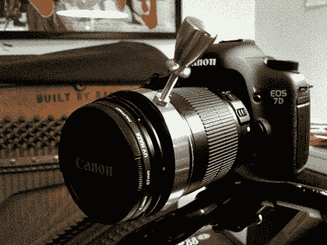

# 五金店关注焦点

> 原文：<https://hackaday.com/2010/01/22/hardware-store-follow-focus/>

想用你的 DSLR 快速准确地改变焦距吗？这里有一个[讨论主题](http://www.dvxuser.com/V6/showthread.php?t=192919)涵盖了非常便宜的解决方案。首先是一根[花椰菜橡皮筋和几条拉链](http://hackaday.com/wp-content/uploads/2010/01/zip-tie-follow-focus.jpg)。这有点小气，[上面看到的更受欢迎的版本](http://www.dvxuser.com/V6/showpost.php?s=79aefb8eaf863763914aae96f418f6a2&p=1834032&postcount=4)使用了一个软管夹、橡皮筋垫、一个抽屉拉手、一个螺母和一些螺纹杆。如果你建立它，非常小心不要过度拧紧夹具和压碎你的对焦环！休息之后，我们嵌入了一个视频，通过镜头显示 follow focus 的样子，以及在拍摄过程中相机发生了什么。

<https://player.vimeo.com/video/4241793>

 
关注焦点示例视频
 
<iframe src="https://player.vimeo.com/video/4270555" width="800" height="480" frameborder="0" webkitallowfullscreen="" mozallowfullscreen="" allowfullscreen=""/>
 
如何构建跟随焦点句柄
 
[ <a href="http://www.flickr.com/photos/ratio/4238371795/in/photostream/" target="_blank">照片来源</a>
 
[通过<a href="http://gizmodo.com/5454640/canon-7d-loaded-with-6-diy-follow-focus" target="_blank"> Gizmodo </a>
 </body> </html>