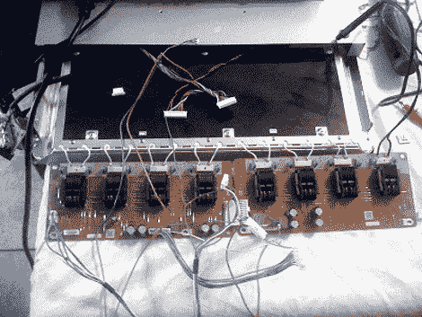

# LCD 背光维修

> 原文：<https://hackaday.com/2010/01/22/lcd-backlight-repair/>

另一台坏了的液晶电视出现了。这台[的背光坏了，他想修理](http://stevediraddo.com/?p=31)。为了使用逆变器，他报废了他的[液晶光桌](http://hackaday.com/2008/09/22/broken-lcd-tv-turned-into-a-light-table/)。这两台电视尺寸不同，也不是由主要制造商制造的，但背光的工作原理都是一样的。使用稍大型号的逆变器意味着它将有足够的电力来点亮灯具，但他知道连接器和引脚会有问题。经过一点测试和创造性的布线，他让系统恢复运行。

他有一些每台电视剩余的零件，包括一束 CCFL 灯。听起来是时候给他的自行车添加一些地面效果了。