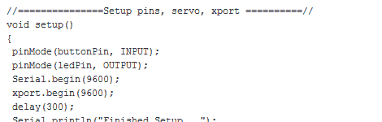

# 黑客日链接:1 月 24 日周日

> 原文：<https://hackaday.com/2010/01/24/hackaday-links-106/>

大家都记得[自由日](http://hackaday.com/2010/01/17/free-day-recap-video-and-book-recommendation/)吧？(创意者的)巴士海盗装在这样一个漂亮的红盒子里——他决定把它作为他的[永久案例](http://www.instructables.com/id/Introducing-the-SparkPirate/)。

[Chico]正在制作 CNC，但决定同时用步进器制作一些音乐。

看起来像旧木箱的东西，其实是【Ludvig 的】超甜复古[街机柜](http://ludw.se/blog/articles/3/mr-robotos-arcade)。配有一个巨大的紧急停止红色按钮。

谁说乐高死了？[卡尔]用它们制造了一个简单廉价的[衍射光栅投影仪](http://laserpointerforums.com/f48/diffraction-gratings-full-awesome-47429.html)。包括[视频](http://www.youtube.com/watch?v=dZDe7R2SrZE)！

[Torchris]完全按照设计使用了以太网屏蔽，通过以太网发送[数据。对于那些需要帮助使用以太网屏蔽和 Arduino 的人来说，这仍然是一个不错的方法。](http://opensourceprojects-torchris.blogspot.com/2010/01/arduino-motion-control-over-ethernet_21.html)

最后[Robert]让我们了解一个朋友 [Arduino 二进制时钟](http://kennethfinnegan.blogspot.com/2010/01/arduino-binary-clock.html)。但是我们认为他优雅地使用胶带和喷砂机在[雕刻玻璃](http://kennethfinnegan.blogspot.com/2009/09/more-glass-etching.html)更酷。