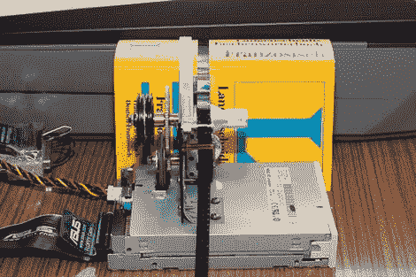

# 自动化 Super8 胶片扫描

> 原文：<https://hackaday.com/2010/01/25/automated-super8-film-scanning/>

对于那些一直害怕有一天你不得不找出那些超 8 格式的旧家庭电影并把它们数字化的人来说，不要再害怕了。现在你可以把它变成一个很酷的项目。[Photobsen]发布了一个自动系统的图片，该系统用于扫描电影并将其编译成数字电影。已经有了一款叫做 [CineToVid](http://hosting.aktionspotenzial.de/CineToVidWiki/index.php/Hauptseite) 的软件，它可以从扫描的片段中创建一个视频，但是进行实际的扫描相当费力。[Photobsen]用一个旧的软驱通过并口连接到他的电脑上，建立了一个快速的自动化系统。他现在每小时扫描大约 80 秒的胶片，无人看管。