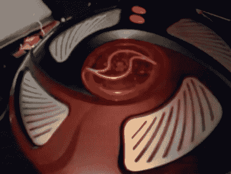

# 满嘴脏话的游戏会给你带来麻烦

> 原文：<https://hackaday.com/2010/01/25/foul-mouthed-game-will-get-you-in-trouble/>

[冰箱头]修改了他的 Simon Says [游戏，为每个点亮的按钮](http://www.instructables.com/id/Simon-Swears-now-with-geniune-casing-and-electri/)添加了一个脏话。这是一个真正的好方法，既可以教孩子说脏话，又可以让儿童保护机构来拜访你。硬件已经被修改为使用一个 Arduino 和一个 [ISD 音频芯片](http://katiebauer.com/itp/isd/)。这些芯片可以记录和回放声音。虽然[冰箱头]可以让它说任何他想说的话，但选择四个你不会在你妈妈面前说的词。我们应该警告你，如果你在工作，休息后不要播放视频，否则会是你的老板来找你，而不是你失望的妈妈。

正如我们之前说过的，这些视频由于脏话而对工作不安全。

 <https://www.youtube.com/embed/KRV1e_cJ_c0?version=3&rel=1&showsearch=0&showinfo=1&iv_load_policy=1&fs=1&hl=en-US&autohide=2&wmode=transparent>

 
西蒙在行动中发誓
 <iframe class="youtube-player" width="800" height="480" src="https://www.youtube.com/embed/G4kd7ZqKCsg?version=3&amp;rel=1&amp;showsearch=0&amp;showinfo=1&amp;iv_load_policy=1&amp;fs=1&amp;hl=en-US&amp;autohide=2&amp;wmode=transparent" allowfullscreen="true" style="border:0;" sandbox="allow-scripts allow-same-origin allow-popups allow-presentation"/> 
西蒙发誓:勇气
 </body> </html>