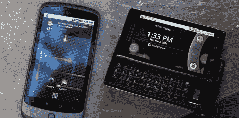

# 为 Droid 和 Nexus One 解锁多点触控

> 原文：<https://hackaday.com/2010/01/25/unlocking-multitouch-for-droid-and-nexus-one/>

我们是缩放的粉丝，这意味着多点触摸。虽然 Nexus One 和 Droid 手机的硬件和操作系统都支持该界面，但它被锁定在股票安装之外。如果你愿意做一点固件改动，你可以让[多点触摸在两部手机](http://gizmodo.com/5455414/how-to-get-multitouch-on-your-droid-or-nexus-one)上工作。

编码已经为你做好了，这是一个加载自定义内核的问题。 [Nexus One](http://hackaday.com/2009/12/31/nexus-one-rooted/) 和 [Droid](http://hackaday.com/2009/12/09/verizon-users-shout-i-am-root/) 都已经扎根，这就是你需要用新固件解锁多点触控的原因。除了获得对设备操作系统的完全访问权限，你还需要加载一些支持缩放等功能的不同应用。幸运的是，这些都是现成的，比起股票浏览器、地图和照片应用程序，你可能更喜欢它们。