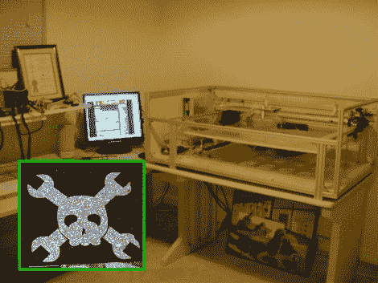

# 建造一个更大更好的激光雕刻机

> 原文：<https://hackaday.com/2010/01/27/building-a-bigger-better-laser-engraver/>

从零开始建造了一个巨大的激光蚀刻机。他的第一批试刻作品包括在磨光的花岗岩地砖上刻下的 Hackaday 骷髅头和扳手(我们喜欢人们这样做)。他用一个 [XMOS 控制器](http://www.buildlog.net/cnc_laser/xmos_controller.html)和 [Mach3 CNC 软件](http://www.machsupport.com/)来操作这个装置。只有两个轴来担心这个看起来像一个简单的项目。难点是控制、冷却和聚焦激光。哦，如果你搞砸了，你可能会失明，烧伤或可怕的残疾。但是如果你从头开始，你会发现巴特知道他在做什么。