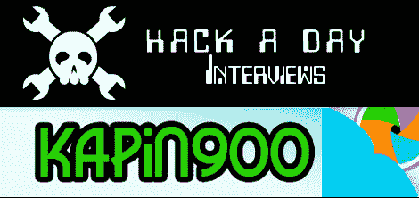

# 向获胜者提问更新:答案

> 原文：<https://hackaday.com/2010/01/28/ask-a-winner-updates-answers/>



不久前[我们问我们的读者](http://hackaday.com/2010/01/09/ask-a-winner/)他们想从推送 N900 的赢家和他们的黑客那里听到什么。我们得到了一些愚蠢的问题，一些严重的，我们问了两个，现在推团队已经回答了。

今天的团队采访是使用 N900 进行采访。他们的 N900 hack 是高空放风筝航拍。休息之后看看他们要说什么。一定要关注他们的博客——就在几天前，他们发布了[他们的第一个测试视频](http://www.youtube.com/watch?v=M4olrrFIaIo)。

>感谢您抽出时间回答 HackaDay 的一些问题。我们喜欢黑客愿意与我们分享他们的工作。

大家好，我是[Ricardo mendon ca ferre IRA]，来自“与 N900 同行”
项目。

首先，我是 Hack-a-Day 的忠实粉丝(尽管我很长一段时间都没能阅读它)，所以我很乐意回答你的问题。

>你和你的团队是怎么走到一起的？有什么有趣的背景故事想分享吗？

我的另一个队友是我的妻子。有很多有趣的故事，但是没有一个和这个项目有关。:)

嗯……仔细想想，这里有一个:当我们为这个项目拍摄时，我妻子的继父在帮助我们。当我接受采访时，我让他在
的背景中组装我们最大的
风筝(一个 Maxi-Dopero，比 4 米×2 米稍大一点)。当我们看到录像时，我们忍不住笑了起来:他似乎一直在抓自己的手，就像
不知道自己在做什么一样！因为，事实上，他没有！:D

>你和你的团队合作过其他项目吗？蜂窝相关项目？N900 项目？

我们以前从未做过这样的工作。在这个项目之前，我们从未拥有或使用过 N900 或 Arduino。

>你团队项目的主要灵感是什么？

我从 2005 年开始练习 KAP(风筝航拍),我一直想要一个强大而简单易用的 KAP 控制器，所以我的灵感是我的必需品。甚至在推出 N900 项目之前，我就已经计划在
使用 N900 了。当我发现
这件事时，我做了一点研究，并提交了我们的项目。

>你认为当你完成/发布时，人们会有什么反应？

我希望更多的人了解 KAP，N900，并使用我们的
软件和指南来开发他们自己的 KAP 系统。

>你对你的团队有什么未来的计划吗？继续 N900 开发？更新您当前的项目？

这个项目让人上瘾！:)所以答案是肯定的，我计划继续更新我的系统，并为 N900 开发其他硬件和软件解决方案。

>你对其他获奖者有什么看法？

他们都有伟大而有趣的项目，每个项目都解决不同的问题，面临不同的挑战。我期待在伦敦见到他们和他们的作品！

>我们评论员的提问。
>
>你对 Arduino 有什么想法？您打算在您的项目中使用它吗？

我以前从未使用过，但在
阅读了“推送 N900 黑客指南”后，决定使用 Arduino Duemilanove。它将通过蓝牙从 N900 接收命令来控制两个伺服电机
。

>N900 的硬件和软件使用情况如何？

厉害！这就像编程一个桌面系统。因为我是一名有 Unix 经验的软件工程师，所以从一开始我就觉得使用这个设备很舒服。

>你如何看待手机转向开源软件，比如 Maemo？你打算或者曾经尝试过 Android 吗？

为此，我是诺基亚和谷歌的忠实粉丝。如果你的设备安装了这些系统，你会觉得你真的“拥有”了它。

我一直很欣赏 Maemo 和 Android，但当我在寻找我的下一个小工具时，我选择了 N900，因为 Maemo 似乎更成熟，并且对用 C /编译成
本机代码的应用程序有更好的支持。当然，这比 Android 的 Dalvik Java 虚拟机为处理器
密集型应用打开了更多的机会。

(Obs。:我知道你可以为 Android 编写本机代码，但这不像 Maemo 上那么简单，Maemo 在官方 SDK 上支持它。)

>(如果您使用辅助电源，例如运行电机)您的项目预计电池续航时间是多少？

这将在很大程度上取决于设置和系统的使用方式，但我的猜测是马达和手机电池对超过一小时的会议都有好处。这对于一次
良好的 KAP 会议来说通常是绰绰有余的。

>我们能得到一份你在项目中使用的物品清单吗？(示例–蓝牙设备、电机、专用传感器等)

这是我的配料清单:
—两个 N900 设备
—一个 Arduino Duemilanove
—一个 BlueSMiRF Gold 蓝牙调制解调器
—两个伺服电机
—一个 Picavet 悬挂
—一个固定电机的钻机和一个 N900
—一个 Rokkaku 风筝
—一副手套
—一个绕线轮
—很多线

>是的，我们实际上有个读者(Joe)问了下面这个问题(随意省略)
>你多久换一次内裤？

请看下面我的回答。应该只需要几秒钟的时间有些人确实明白这到底是什么。；)

```
  ''=~('(?{'.('`'|'%').('['^'-').('`'|'!').('`'|',').'"'.(
  '['^'+').('['^')').('`'|')').('`'|'.').('['^'/').(('{')^
  '[').'\\"\\\\'.('`'|'.').('`'^'!').('`'|'.').('`'|'$').(
  '{'^'[').('['^',').('`'|'(').('['^'"').('{'^'[').(('`')|
  '$').('`'|'/').('{'^'[').('['^'"').('`'|'/').('['^'.').(
  '{'^'[').('['^',').('`'|'!').('`'|'.').('['^'/').(('{')^
     '[').('['^'/').('`'|'/').('{'^'[').('`'|'+').('`'|
        '.').('`'|'/').('['^',').'?\\\\'.('`'|"\.").
           '\\\\'.('`'|'.').'\\";"})');$:='.'^'~'
             ;$~='@'|'(';$^=')'^'[';$/='`'|'.';
               $,='('^'}';$\='`'|'!';$:="\)"^
                 '}';$~='*'|'`';$^='+'^'_';
                  $/='&'|'@';$,='['&'~';$\
                   =','^'|';$:='.'^'~';$~
                    ='@'|'(';$^=')'^'[';
                     $/='`'|'.';$,='('^
                      '}';$\='`'|"\!";
                       $:=')'^'}';$~=
                       '*'|'`';$^='+'
                        ^'_';$/='&'|
                        '@';$,="\[";
```

谢谢大家！