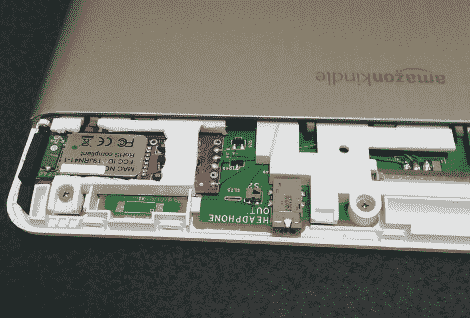

# 向您的 Kindle 添加蓝牙终端

> 原文：<https://hackaday.com/2010/01/31/add-a-bluetooth-terminal-to-your-kindle/>

这是一个亚马逊 Kindle DX，里面插着一个 Sparkfun 蓝牙伴侣。【达隆】[一起黑掉了两个](http://www.griffin.net/2010/01/hacking-the-amazon-kindle-dx-part-1.html)为了在设备上有一个无线串行终端。Kindle PCB 的中间有三个大垫，标有 GND、RX 和 TX，很容易找出这些连接。获得电压有点困难。他设法找到了 Kindle 唤醒开关一侧的 4V 电压，这个开关工作正常，因为[蓝牙伴侣](http://www.sparkfun.com/commerce/product_info.php?products_id=9358)有一个电压调节器。为了保护蓝牙模块，他修改了它，从板载调节的 3.3V 上拉 TX，而不是从 Kindle 来的 4V。

他还在这个设备上做了一些软件工作，现在他可以很容易地使用它了。沿着 9 月份开始的 Ubuntu-on-Kindle hack 的路线，他为 Kindle 编译了 [QT，并编写了几个程序，如 Sudoku，以证明它是可行的。](http://www.griffin.net/2010/01/hacking-the-amazon-kindle-dx-part-2-qt-and-sudoku.html)