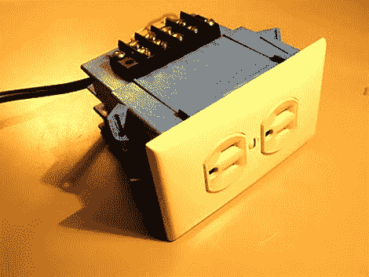

# 120 伏开关

> 原文：<https://hackaday.com/2010/01/31/120v-switching/>

[Kenneth]在接线盒内建造了一个 5v 受控电源插座。我们已经看到很多项目可以使用 5v 逻辑为[冰箱控制器](http://hackaday.com/2009/12/26/replacement-refrigerator-controller/)、[照明控制器](http://hackaday.com/2009/12/02/x-mas-hack-8-channel-musical-show/)或[生长系统](http://hackaday.com/2009/09/15/grow-box-controls-heater-fans-and-water/)切换 120v 插座，但他们几乎总是使用固态继电器来促进切换。这种迭代使用机械继电器以及必要的保护电路。该项目被安置在一个超深的单组盒中，允许两个插座的单独开关。你可以看到这连接到一个 Arduino 切换两盏灯后休息。

 <https://www.youtube.com/embed/rnIrzqyprY8?version=3&rel=1&showsearch=0&showinfo=1&iv_load_policy=1&fs=1&hl=en-US&autohide=2&wmode=transparent>

 
[谢谢 Mightysinetheta]
 </body> </html>