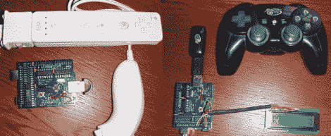

# 使用 USB 主机保护罩的游戏控制器

> 原文：<https://hackaday.com/2010/02/01/game-controllers-using-usb-host-shield/>

[I-Bot]已经整合了一些库，使得通过 Arduino 使用游戏控制器变得更加容易。他们通过 [USB 主机屏蔽](http://hackaday.com/2009/08/21/arduino-usb-host-shield/)接口。这意味着 PS3 控制器通过电缆或加密狗经由 USB 连接。有了 Wii 遥控器，事情变得更有趣了。一个[蓝牙加密狗](http://hackaday.com/2009/08/08/tiny-bluetooth-teardown/)用于无线连接。我们这里有一种便宜而简单的方法来为您的项目添加蓝牙连接，要么通过 USB 主机屏蔽，要么通过使用 Circuits@Home 提供的[原理图和代码构建您自己的硬件](http://www.circuitsathome.com/downloads)。有几页带您浏览使用的协议，休息后您可以观看演示视频。 <https://www.youtube.com/embed/cYcp4gfRY_A?version=3&rel=1&showsearch=0&showinfo=1&iv_load_policy=1&fs=1&hl=en-US&autohide=2&wmode=transparent>

 </body> </html>