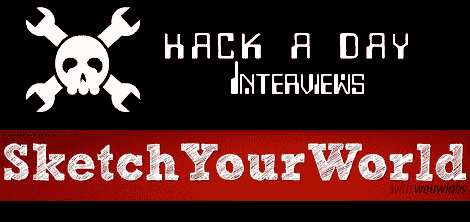

# 向获胜者提问更新第 3 天:答案

> 原文：<https://hackaday.com/2010/02/01/ask-a-winner-updates-day-3-answers/>

不久前[我们问我们的读者](http://hackaday.com/2010/01/09/ask-a-winner/)他们想从推送 N900 的赢家和他们的黑客那里听到什么。我们得到了一些愚蠢的问题，一些严重的，我们问了两个，现在推团队已经回答了。

N900 推展的日子越来越近，因此团队越来越紧张。但是《勾勒你的世界》的团队愿意在百忙之中抽出时间接受我们的采访。一如既往地，在他们的[博客](http://blogs.nokia.com/pushn900/category/sketch-your-world/)上了解团队的最新进展——他们已经开始在蚀刻草图(tm)上画画了，它甚至(好吧，它不是真的，但它仍然在进步)[看起来像一个圆](http://blogs.nokia.com/pushn900/2010/01/28/the-mysterious-progessive-error/)！

>感谢您抽出时间回答 HackaDay 的一些问题。我们喜欢黑客愿意与我们分享他们的工作。

>你和你的团队是怎么走到一起的？有什么有趣的背景故事想分享吗？

我([天啊]，又名[赫苏斯·桑切斯-帕伦西亚])在计算机工程毕业时认识了[安妮](又名[安娜·塞西莉亚·马丁斯])和[卡莱加](又名[菲利普·卡莱加里奥])。有一天[安妮]成了我的女朋友，我们开始一起做一些我们喜欢做的疯狂的事情。[Calega]也在从事他自己的一些很酷的项目，有一天，在谈论想法、项目、生活、宇宙和其他一切的时候，我们注意到我们(和一些其他的朋友)有这种意愿去从事数字交互、硬件/软件/人类行为黑客。所以我们决定创建 Wouwlabs 小组。(wouwlabs.com)

[Patifa] ([Patricia Montenegro])是一名非常熟练的建筑师，同时也是一名设计师。她是我的同事。一天，我邀请她在大学做一个关于“设计师和开发者之间的关系”的讲座，Wouwlabs 的人非常喜欢她的作品。推动 N900 是一个很好的机会，让她与我们一起工作，并加入我们的 Wouwlabs！=D

>你和你的团队合作过其他项目吗？蜂窝相关项目？N900 项目？

嗯，我和[帕特丽夏]主要从事移动开发。是的，我们有一些其他的蜂窝项目，是的，我们有一些 N900 项目。一个很好的选择是 Qt 移动演示([http://wouwlabs.com/blogs/jeez/?p=135](http://wouwlabs.com/blogs/jeez/?p=135))。还可以看看帕蒂法的博客(【http://patifa.wordpress.com/】T2)！

我、[Annie]和[Calega]之前合作过几个项目。查看我们的博客([http://wouwlabs.com](http://wouwlabs.com))并在那里点击我们的名字是很棒的！)为了看他们。我们甚至制作了一个多点触控的桌子！:)

我和[安妮]有一个细胞相关的项目。我们和一个叫 Jambo 的媒体经理一起参加了第一届 Android 开发竞赛。

在这个特别的项目上(勾画你的世界！)我们每个人都有自己的工作:[Annie]是我们的图像处理专家，负责绘制算法，patifa 是我们的设计专家，负责应用程序的 GUI 和原型的最终版本，[calega]负责 Arduino 的工作，组装所有东西，我负责 Maemo 方面，在 Qt 中开发应用程序，并将所需的东西移植到 Maemo 5。

>你团队项目的主要灵感是什么？

[Calega]应该回答这个问题，但 AFAIR，他有这个固定的想法蚀刻素描和如何很难在他们身上画。我们小时候不能在上面画任何东西，现在我们长大了也不能。所以他想，既然我们可以为它编写一个 Arduino，那么最终在它上面画一些画会很好。:)

>你认为当你完成/发布时，人们会有什么反应？

嗯，开心吗？！:P
我还没想过这个问题，因为我真的很想及时完成它！:P
但是我真的希望大家都喜欢！

>你对你的团队有什么未来的计划吗？继续 N900 开发？更新您当前的项目？

我们真的在考虑用 Arduinos 和 N900 做一些更疯狂的事情，也许会在 N900 上做一些不错的应用。我们都有很多想法，必须设法有时间去实现它们(同时还要通过我们的日常工作赚些钱……；)

我可以说，我正在考虑在接下来的几个月里玩 Arduino+RFID+蓝牙+N900……让我们看看……)

>你对其他获奖者有什么看法？

我真的喜欢所有的项目。真的！我也愿意去了解其他团队！视频集总是那么好，人们似乎很有趣。
hyper boxe 在这次竞赛中表现出色，他们设法获得了一些非常好的项目和团队来参与其中！:)

>我们评论员的提问。

>你对 Arduino 有什么想法？您打算在您的项目中使用它吗？

自从我第一次接触 Arduino 平台，我就是它的粉丝。作为一名计算机工程师，我以前用过其他几个主板和微控制器，但 Arduino 是最简单的一个。有东西在上面跑真是太快了！你可以使用连线，这是一种非常简单的编程语言。令人惊讶的是，如今有许多不同的人在使用 Arduino。从开发商到美工！
是的，我们在项目中使用了 Arduino！

>N900 的硬件和软件使用情况如何？

Maemo 5 是一个非常好的平台！是同时以用户为中心和以开发者为中心！开发一个应用程序是多么的简单(使用 Qt！:P)并让它在您的手机上运行。现在我们有了 Qt 框架，一切都变得如此简单！我们可以做一些花哨的应用，并让它们在手机上流畅运行。没错，就是手机！:)
还有 N900 的硬件……我能说什么呢？！这是有史以来最好的手机！这是有史以来最好的平板电脑！
你什么都有！

>你如何看待手机转向开源软件，比如 Maemo？你打算或者曾经尝试过 Android 吗？

是的，我试过安卓系统。IMHO，Android _looks_ nice。但我的赞美止于此。我曾经读过一篇关于它的内部结构的论文，所有的东西看起来都很粗糙……
我不喜欢 UI 本身，从我目前所看到的运行它的手机来看。
当我和[Annie]尝试时，我不喜欢为它开发。

所以是的，我想我可以说我不喜欢 Android。:)
但只是我一个人，对吧？！

>(如果您使用辅助电源，例如运行电机)您的项目预计电池续航时间是多少？

我们使用交流适配器(9v，0.5 A)。所以我预计“电池”寿命大约是地球仍能提供的所有能量。:)

>我们能得到一份你在项目中使用的物品清单吗？(示例–蓝牙设备、电机、专用传感器等)

我们使用 BlueSmirf Gold 蓝牙调制解调器、Arduino duemilenove、Ladyada 的 motorshield 和两种步进电机:
——来自 spark fun([http://www.sparkfun.com/commerce/product_info.php?的步进电机 products _ id = 9238](http://www.sparkfun.com/commerce/product_info.php?products_id=9238))
——Conrad . de 的:42MM SCHRITTMOTOR (0.8 BIS 1.5A)

当然，我们也使用 Etch-a-Sketch (TM)和有机玻璃作为原型的支架。

>是的，我们实际上有个读者(Joe)问了下面这个问题(随意省略)
>你多久换一次内裤？

内衣？！人们还穿那个吗？！
:)

开玩笑的。在巴西(一个叫累西腓的城市)，天气太热了，我们通常每天洗 2 到 3 次澡。而且我每次洗澡都会换内裤…

在德国，每年这个时候都很冷，所以我通常两天换一次内裤。=D

谢谢你给我这个机会！[天啊]