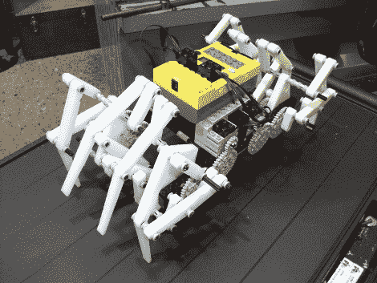

# 乐高蜘蛛机器人

> 原文：<https://hackaday.com/2010/02/03/lego-spider-bot/>

乐高蜘蛛机器人(LEGO spider robot)将 Mindstorm 套件中的零件与一些研磨过的塑料零件结合在一起。这条腿是一个名为 [Klann 连杆](http://en.wikipedia.org/wiki/Klann_Linkage)的机车概念。它们成对工作，将一个马达的旋转力转化为两条腿的运动。在这里，总共四个旋转齿轮移动八条腿，在腿数和马达经济性方面都超过了[我们几周前看到的六足机器人](http://hackaday.com/2010/01/21/spiderbot-prompts-laser-envy/)。

每个肢体由五部分组成，每一对都有一个底座。每对有 11 件，整个机器人总共有 44 件。[MkMan]从 3/8”高密度聚乙烯原料中磨出这些零件。他制作了向前运动和转弯的视频，我们在休息后嵌入了这些视频。即使在光滑的表面上，这个机器人看起来也很有效率。

 <https://www.youtube.com/embed/hz4mflE2foM?version=3&rel=1&showsearch=0&showinfo=1&iv_load_policy=1&fs=1&hl=en-US&autohide=2&wmode=transparent>

 
向前走
 <iframe class="youtube-player" width="800" height="480" src="https://www.youtube.com/embed/Bl_5wCbvxMU?version=3&amp;rel=1&amp;showsearch=0&amp;showinfo=1&amp;iv_load_policy=1&amp;fs=1&amp;hl=en-US&amp;autohide=2&amp;wmode=transparent" allowfullscreen="true" style="border:0;" sandbox="allow-scripts allow-same-origin allow-popups allow-presentation"/> 
旋转
 </body> </html>