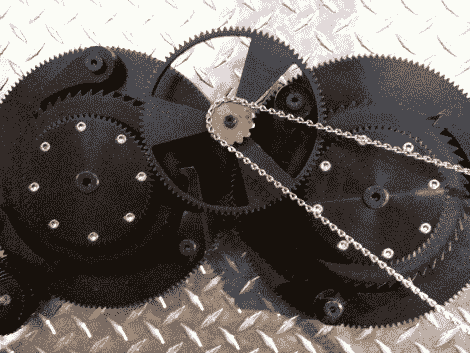

# 机械二极管

> 原文：<https://hackaday.com/2010/02/03/the-mechanical-diode/>

二极管只允许电流单向流动。考虑到这一点，[Alex] [制造了一个机械二极管](http://www.brainlubeonline.com/diodemachine/Intricacies_of_the_Diode_Machine.html)，它只允许齿轮在一个方向上的旋转通过系统传递。但是等等，通过把两个这样的设备连接在一起，他已经建立了一个机械整流器。一个电[整流器](http://en.wikipedia.org/wiki/Rectifier)将交流电转换成直流电，这个机械版本输出顺时针旋转，无论设备的旋转方向如何。

休息后我们在他的网站上嵌入了视频和许多图片，但没有太多的解释。这是我们的推断。两个大齿轮是输入。安装在它们上面的是一个较小的棘轮装置，只能朝一个方向转动。这个棘轮齿轮选择左边或右边最小的齿轮是否旋转，然后输送到这个图像顶部的输出齿轮。 <https://www.youtube.com/embed/M_CKvfuukRc?version=3&rel=1&showsearch=0&showinfo=1&iv_load_policy=1&fs=1&hl=en-US&autohide=2&wmode=transparent>

 </body> </html>