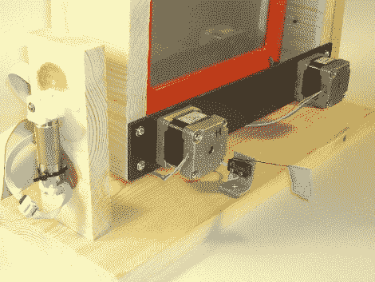

# Propeller 将 Step-a-Sketch 推向了一个新的高度

> 原文：<https://hackaday.com/2010/02/04/propeller-takes-step-a-sketch-to-a-new-level/>

螺旋桨控制的蚀刻草图建造得很好，非常精确。他受到了[草图项目](http://hackaday.com/2010/01/04/step-a-sketch/)的启发，并将该设计进行到了令人惊叹的地步。驱动板围绕 Parallax Propeller P8X32A 微控制器构建。但这不仅仅是一个将硬件连接到运行 CNC 软件的 PC 的串行控制板。他包括电视输出和键盘端口，以便编程可以在芯片上完成。

在休息后的视频中，你可以看到 Etch-a-Sketch 上的绘图有多精确。它安装得很好，但也受益于一些软件对玩具不精确控制的补偿。[Mpark]还包括一个擦除功能，可以将画面上下翻转几次。这不仅用于擦除绘图，还用于隐藏将手写笔移动到起始位置时创建的线条。

[https://www.youtube.com/embed/MgyZgqImAHA?version=3&rel=1&showsearch=0&showinfo=1&iv_load_policy=1&fs=1&hl=en-US&autohide=2&wmode=transparent](https://www.youtube.com/embed/MgyZgqImAHA?version=3&rel=1&showsearch=0&showinfo=1&iv_load_policy=1&fs=1&hl=en-US&autohide=2&wmode=transparent)