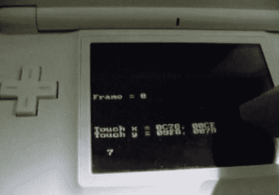

# Arduino 到任天堂 DS 接口

> 原文：<https://hackaday.com/2010/02/05/arduino-to-nintendo-ds-interface/>

[Hounjini]正在摆弄他的任天堂 DS lite 的 Game Boy Advanced 总线，并想出了如何使用它来将 Arduino 连接到 DS。为了测试，他将一个 IDC 插头焊接到墨盒盖引脚接口，但这只需要四个连接。休息后，Arduino 可以从 DS lite 发送和接收数据，如示例视频所示。通过使 Arduino 看起来像一个 DS 乐于与之交谈的控制器，数据访问成为可能。

 <https://www.youtube.com/embed/CnBe5NonHLA?version=3&rel=1&showsearch=0&showinfo=1&iv_load_policy=1&fs=1&hl=en-US&autohide=2&wmode=transparent>

 <iframe class="youtube-player" width="800" height="480" src="https://www.youtube.com/embed/B3aEGCiGEaA?version=3&amp;rel=1&amp;showsearch=0&amp;showinfo=1&amp;iv_load_policy=1&amp;fs=1&amp;hl=en-US&amp;autohide=2&amp;wmode=transparent" allowfullscreen="true" style="border:0;" sandbox="allow-scripts allow-same-origin allow-popups allow-presentation"/> <iframe class="youtube-player" width="800" height="480" src="https://www.youtube.com/embed/BddcjIB_sPQ?version=3&amp;rel=1&amp;showsearch=0&amp;showinfo=1&amp;iv_load_policy=1&amp;fs=1&amp;hl=en-US&amp;autohide=2&amp;wmode=transparent" allowfullscreen="true" style="border:0;" sandbox="allow-scripts allow-same-origin allow-popups allow-presentation"/> 
[谢谢基督教]
 </body> </html>