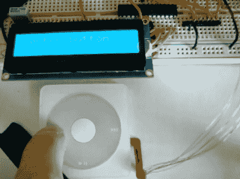

# 重新利用点拨轮

> 原文：<https://hackaday.com/2010/02/05/repurposing-a-click-wheel/>

我们认为点拨轮是最初 iPods 成功的最大功臣。这些设备是一块带有单色屏幕的砖头，但用户界面很光滑，易于使用。[Jason]决定在他自己的项目中添加一个点拨轮。在使用了一个逻辑分析仪后，他发现它不能实现一个通用的协议，比如 I2C，这可能是苹果公司有意将控制器隐藏起来的举动？正如在休息后的视频中看到的那样，他设法通过点击转盘中的数据，然后逆向工程协议，克服了这一障碍。

它与 AVR ATtiny88 相连，反馈显示在字符 LCD 屏幕上。我们很高兴[Jason]向我们透露了这个消息，但是他[还没有任何可用的代码](http://jasongarr.wordpress.com/project-pages/ipod-clickwheel-hack/)。我们喜欢深入到源头，所以他越早发现越好！我们有一个旧的第三代，有一个坏的主板，正乞求把轮子从它身上扯下来，更不用说易趣上可以买到的非常便宜的替代品了。T3[https://www.youtube.com/embed/O2DZd3MBNPc?version=3&rel=1&showsearch=0&showinfo=1&iv_load_policy=1&fs=1&hl=en-US&autohide=2&wmode=transparent](https://www.youtube.com/embed/O2DZd3MBNPc?version=3&rel=1&showsearch=0&showinfo=1&iv_load_policy=1&fs=1&hl=en-US&autohide=2&wmode=transparent)