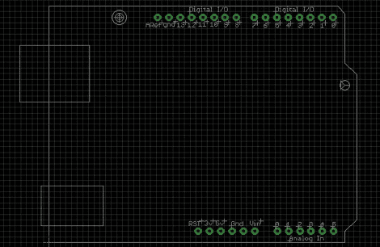

# 更新:阿达果鹰图书馆，现在与 Arduino

> 原文：<https://hackaday.com/2010/02/06/update-adafruit-eagle-library-now-with-arduino/>

Adafruit Industries】刚刚在他们的 EagleCAD 库中添加了一个 Arduino 盾形足迹。如果你不知道， [Arduino 接头使用非标准引脚间距](http://hackaday.com/2009/07/16/arduino-shield-with-offset-headers/)。学会处理它，生产中有太多的 Arduino 护盾，对未来的改变不抱任何希望。这将使你设计自己的电路板变得更加容易。如果你使用这个包，确保你从他们的 github，[那里得到这个库，他们一直在定期添加部件](http://github.com/adafruit/Adafruit-Eagle-Library/commits/master/)。设置[版本控制](http://hackaday.com/2010/01/07/version-control-for-eagle/)将确保你总是拥有最新的库。

[感谢 pt]