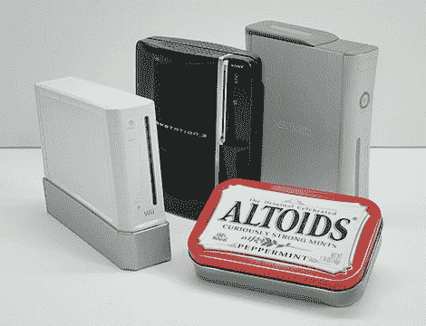
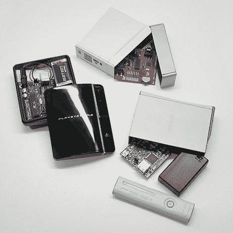

# 礼品卡罐抢尽风头

> 原文：<https://hackaday.com/2010/02/07/altoids-upstaged-by-gift-card-tins/>

这里没有什么惊天动地的事情。只是，我们敢说，真的很可爱！

古老的 Altoids 薄荷罐已成为制造商文化的标志。浏览过去关于 Hack a Day、Adafruit 或 Instructables 的文章，你会发现这些口袋大小的外壳为一个又一个项目提供了合适的选择。非常实用，价格适中，但美学偶尔也有不尽如人意的地方。

我们最近偶然发现了这些漂亮的礼品卡持有者，它们类似于当代游戏机的微型版本。它们可能是你下一个微控制器项目的完美住所…

这些是从我们当地的 [GameStop](http://www.gamestop.com/) 零售店购买的，不幸的是，似乎无法在网上买到。每个要花你 2.99 美元——比薄荷糖多 1 美元，而且没有额外的清新口气的好处。这就是时尚的代价。

形状多种多样，但都比传统的 Altoids 罐稍大，为电池组、试验板或微控制器提供了充足的空间。和薄荷罐一样，你当然想把你的项目和内部金属表面隔离开来。一些联系纸甚至一些索引卡通常就足够了。

除了这里描述的 [Xbox 360](http://hackaday.com/2007/07/24/xbox-360-hacking-101-extra/) 、 [Wii](http://hackaday.com/2008/08/14/watching-dvds-on-your-wii/) 和 [Playstation 3](http://hackaday.com/2010/01/27/ps3-exploit-released/) 游戏机之外，便携式游戏机 [PSP](http://hackaday.com/2009/03/30/psp-as-a-status-monitor/) 和[任天堂 DS Lite](http://hackaday.com/2008/06/29/nintendo-ds-homebrew-music-apps-roundup/) 也有迷你版。