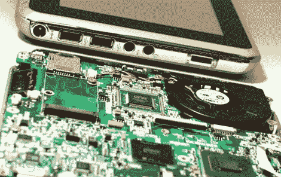

# ExoPC 展示了一些胆量

> 原文：<https://hackaday.com/2010/02/07/exopc-shows-off-some-guts/>

Engadget 的人发布了一些 ExoPC 内部的图片。随着最近平板电脑热潮的回归(还记得 xp 平板电脑版吗？)我们到处都能看到平板电脑。这一款在硬件方面有一些承诺，配备 1.6GHz 处理器和 2GB 内存。不幸的是，我们听说在 windows7 上单独使用平板电脑界面有些麻烦，即使有内置的改进。不过我们并不太担心，定制的设备风格的 linux 界面可能不会太远。

上次我们提到平板电脑风格的计算时，人们已经给我们发了关于 [Touchbook](http://www.alwaysinnovating.com/touchbook/) 的邮件。这看起来也很酷，但在演示视频中，切换应用程序似乎明显滞后。然而，一个精简的界面可能会减少一些阻力。