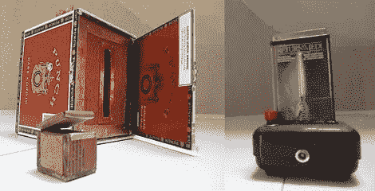

# 性能异常

> 原文：<https://hackaday.com/2010/02/07/performance-oddities/>

魔术师马里奥写信告诉我们，他每天早上喝咖啡的时候都把黑客日作为优先事项。我们也是。在提交这一启示时，他还包含了一个到他主页的链接。像咖啡中的咖啡因一样的有趣的细节在他的文章中消失了。但是黑客是可靠的。

魔术师是黑客。如果你可以出去买道具，这个概念不太可能打动任何人。[马里奥]展示他的[镍盒](http://suitcasemachine.blogspot.com/2009/12/nickel-box.html)和他制作的[绝地心灵诡计](http://suitcasemachine.blogspot.com/2009/11/jedi-mind-trick.html)。镍盒是一个机械装置，它以某种方式将一枚硬币从雪茄盒的一部分转移到它上面的一个小盒子里。绝地心灵魔术使用一个微控制器和一个旧的《星球大战》录音带盒来进行声光表演，同时从一副洗好的牌中取出你选择的牌。很棒的演示，但对里面发生的事情只字未提。

[马里奥的]也有一系列…奇怪的表现。他的会说话的电视接收音频输入，并在一台旧电视上显示 20 世纪 50 年代风格的示波器效果。他试图用回扫变压器[闪电盒](http://suitcasemachine.blogspot.com/2010/01/miniature-lightning-box.html)让他的心脏停止跳动，或者烧掉房子，或者两者兼而有之。还有他的[绘图自动机](http://suitcasemachine.blogspot.com/2009/10/drawing-automaton.html)，好吧，你只要看看就知道了。

我们相信电子，不相信魔法(尽管有人说[没有电子](http://www.amazon.com/There-Are-Electrons-Electronics-Earthlings/dp/0962781592))。所以我们想知道那些魔术道具是怎么造出来的。像任何一个优秀的魔术师一样，[马里奥]大概不会透露自己的秘密。如果你有货，这就是你的机会。写一篇文章详细介绍你的魔法道具建造，然后[把它们发给我们](http://hackaday.com/contact-hack-a-day/)。[如果做得好的话](http://hackaday.com/2009/09/19/how-to-make-your-project-an-internet-sensation/)我们会在 Hackaday 上做专题报道。