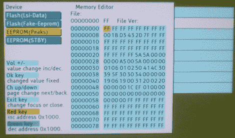

# 内置十六进制编辑器解锁等离子电视功能

> 原文：<https://hackaday.com/2010/02/08/built-in-hex-editor-unlocks-plasma-tv-features/>

[Nick]向我们透露了一份指南，介绍如何解锁松下电视的额外功能。黑客在 G10 型号的等离子电视上工作，并使用服务菜单来访问 EEPROM 存储器。通过几个快速的步骤，你可以用一个内置的十六进制编辑器改变一些数据，解锁几个新的设置菜单，或者将你的娱乐中心变成砖块。我们过去已经看到过一些[三星电视](http://hackaday.com/2009/10/18/samsung-tv-firmware-hacking/)被黑，希望随着今天的型号处理能力的提高，我们有一天会看到带有开源固件的消费电视，这样我们就可以集成[我们最喜欢的娱乐软件](http://hackaday.com/2009/10/30/xbmc-running-on-arm/)。