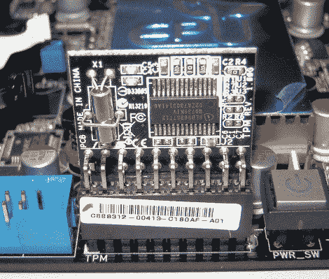

# TPM 加密已破解

> 原文：<https://hackaday.com/2010/02/09/tpm-crytography-cracked/>

基于可信平台模块的加密技术保护您的机密以及政府机密。嗯，以前是。克里斯托弗·塔尔诺夫斯基(Christopher Tarnovsky)[发现了如何通过监视硬件的通信来击败硬件](http://www.nzherald.co.nz/technology/news/article.cfm?c_id=5&objectid=10625082)。这需要物理访问，所以并不像听起来那么糟糕，但这确实超越了 TPM，涉及到英飞凌制造的许多安全芯片。这包括 Xbox 360 的外围安全芯片和一些用于手机和卫星电视的芯片。

[克里斯托弗]在 2010 年黑帽大会上展示他的黑客技术。这种方法非常困难，包括移除芯片的外壳和顶层，然后接入数据总线以获取未加密的数据。该芯片仍然有一些锦囊妙计，包括固件陷阱，可以警惕这种类型的攻击，如果检测到就关闭。英飞凌评论说，他们知道这是可能的，但认为这是一个低威胁，因为成功所必需的高技能水平。

[谢谢格雷格]