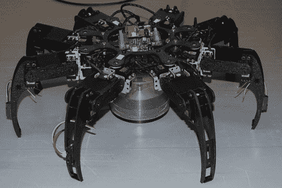

# 经验丰富的机器人有八条腿和喙板

> 原文：<https://hackaday.com/2010/02/11/veteran-robot-features-eight-legs-and-beagleboard/>

这个蜘蛛机器人是[詹克斯]在伊拉克服役期间制造的。他之前没有硬件构建经验，当他在 9 月份收到一个 Arduino 来玩时，他开始了这个项目。一定学得很快！这些零件由 ABS 塑料激光切割而成，连接到 24 个伺服系统。他采购了一个 [SSC-32 串行伺服控制板](http://www.lynxmotion.com/Product.aspx?productID=395&CategoryID=)来处理电机连接。

[Zhanx]已经从 Arduino 迁移到了一个[猎兔犬板](http://hackaday.com/2009/10/30/xbmc-running-on-arm/)，你可以在休息后的视频中看到它栖息在身体上。这应该给他足够的速度和力量来改进动作。这里有一些不错的工作，但增加橡胶脚，就像昨天的[六足机器人](http://hackaday.com/2010/02/10/dexterous-hexapod-rocks-an-atom-processor/)一样，不会有伤害。

[https://www.youtube.com/embed/zX0AAvQiXgA?version=3&rel=1&showsearch=0&showinfo=1&iv_load_policy=1&fs=1&hl=en-US&autohide=2&wmode=transparent](https://www.youtube.com/embed/zX0AAvQiXgA?version=3&rel=1&showsearch=0&showinfo=1&iv_load_policy=1&fs=1&hl=en-US&autohide=2&wmode=transparent)