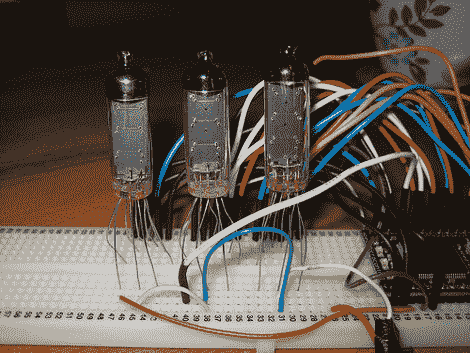

# 互联网控制的滚动数码管

> 原文：<https://hackaday.com/2010/02/12/internet-controlled-scrolling-numitron/>

这对于第一个微控制器项目来说如何:[一个从互联网上提取信息并在一组数字显示器上滚动的收报机](http://zx81.limpfish.com/geeky/mbed_numitron_ticker/)。[大卫·巴顿]用一个 [mbed 微控制器](http://hackaday.com/2009/11/21/review-mbed-nxp-lpc1768-microcontroller/)建造了这个。通过直接连接到 cat5 电缆，他利用以太网库从服务器中提取数据。显示器由三个七段白炽灯泡组成。在广告之后的视频中，你可以看到他用 iPod touch 向它发送信息。这只是一个 PHP 表单，将提交的消息写入一个文件，供 mbed 读取。正如[David]指出的，这里有明显的 Twittering 应用，但我们只是喜欢它的样子！