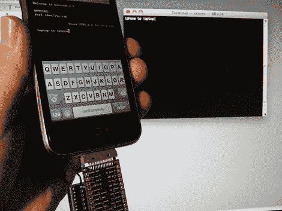

# 开发 IPhone 串行通信

> 原文：<https://hackaday.com/2010/02/15/developing-for-iphone-serial-communications/>

[Hcgilje] [拼凑了一个关于在 iPhone 应用程序中使用串行通信的教程](http://hcgilje.wordpress.com/2010/02/15/iphone-serial-communication/)。它建立在[2007 年发布的 DevDot 教程](http://hackaday.com/2007/12/11/iphone-serial-access-tutorial/)的基础上。从那时起，发生了很多变化；固件已经走过了漫长的道路，现在有几个开发工具可以让事情变得更简单。他的例子使用[界面生成器](http://developer.apple.com/tools/interfacebuilder.html)和[open framework](http://www.openframeworks.cc/)来演示 LED 和伺服电机的 GUI 控制。现在出去为这款流行的手机设计[你自己的外设](http://hackaday.com/2007/12/14/iphone-gps-module/)。