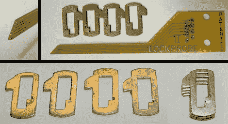

# 电子按键压印

> 原文：<https://hackaday.com/2010/02/15/electronic-key-impressioning/>

【Barry】分享了他对[电子按键印象如何工作](http://blackbag.nl/?p=1187) ( [谷歌缓存](http://74.125.95.132/search?q=cache:http://blackbag.nl/%3Fp%3D1187&hl=en&safe=off&strip=1))的假设。你可能还记得[本月早些时候他的铝箔压印演示](http://hackaday.com/2010/02/03/foil-impressioning-defeats-security-locks/)，但现在他正在讲述一条我们肯定错过的新闻。显然，一种可以在几秒钟内告诉你一把锁的钥匙代码的手持印象设备即将上市。[Barry]根据他使用类似装置瞄准车锁的经验猜测这是如何做到的。当上面看到的电路板插入锁中时，它完成了锁外壳和晶片之间的电路。固件监控 PCB 尖端的导体，以计算切割深度和钥匙上的位置。

用自制的 PCB 试试会很有趣，有没有办法处理电路板边缘这样缠绕走线的问题？