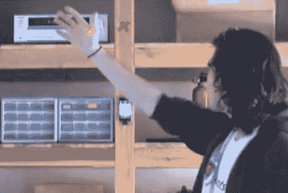

# 如果你想听别的，请举手

> 原文：<https://hackaday.com/2010/02/17/raise-your-hand-if-you-want-to-listen-to-something-else/>

这首歌很糟糕，有人跳过了！这个项目只需一挥手就能做到。激光束穿过房间，当受到阻碍时，它会向 iPod 发送命令。一个波暂停回放，两个波跳到下一个轨道，一个恒定的障碍物向后跳一个轨道。

他们正在使用一种叫做[scheme](http://www.aniomagic.com/schemer/tech_schemer.php)的纺织品兼容电子平台。这是我们第一次碰到这种使用模块化系统通过单线通信总线连接设备的产品。

无论你使用什么样的硬件，这个概念都会引起我们的兴趣。有很多 iPod remote 项目可以作为例子。这种方法似乎比[用头撞击轨道变化](http://hackaday.com/2009/09/14/head-bangers-beware-motion-sensing-headphones/)或[疯狂拍打超大遥控器](http://hackaday.com/2009/04/06/toddler-computer-remote/)更有趣。我们只是有点担心激光笔的功耗，也许红外线光束是更经济的选择？