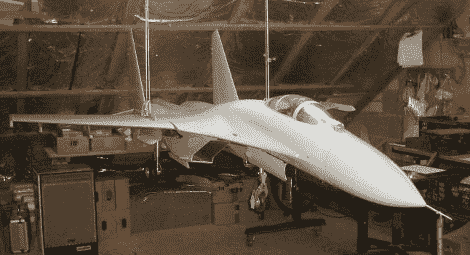

# 苏霍伊苏-27 喷气式飞机制造投掷下来

> 原文：<https://hackaday.com/2010/02/18/sukhoi-su-27-jet-build-throws-down/>

这不是模型，而是功能齐全的遥控飞机。[苏霍伊 Su-27](http://en.wikipedia.org/wiki/Sukhoi_Su-27) 是苏联 F15 的翻版，这个 1/6.5 比例的版本有 11 英尺长，并且是完全可控的。仿佛 80 页的建造日志还不够，休息后的飞行视频简直令人瞠目结舌。试飞以平稳的着陆结束，但是所有的时间都投入到这个项目中，这是令人伤脑筋的。

[https://www.youtube.com/embed/6IKnZ_tkecU?version=3&rel=1&showsearch=0&showinfo=1&iv_load_policy=1&fs=1&hl=en-US&autohide=2&wmode=transparent](https://www.youtube.com/embed/6IKnZ_tkecU?version=3&rel=1&showsearch=0&showinfo=1&iv_load_policy=1&fs=1&hl=en-US&autohide=2&wmode=transparent)

[感谢 M4r1hu4n3 via [Fishkin](http://www.fishki.net/comment.php?id=60565) ]