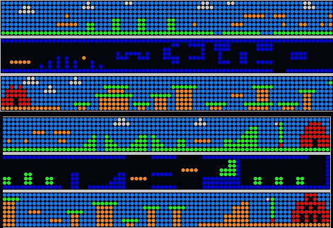

# 更新:最有趣的 64 像素游戏

> 原文：<https://hackaday.com/2010/02/19/update-most-interesting-game-in-64-pixels/>

[布拉德]继续开发超级像素兄弟游戏。几个月前我们看到了[对这个](http://hackaday.com/2009/12/08/ledboy-super-pixel-brothers/)的一瞥，但从那以后他增加了很多。游戏现在有敌人了；一种类似于[子弹比尔](http://en.wikipedia.org/wiki/Bullet_Bill#Bullet_Bill)，另一种从天而降，向你走来，有点像[古姆巴](http://en.wikipedia.org/wiki/Goomba)。游戏玩起来相当灵敏，他在如此低的分辨率下完成了令人惊讶的事情。在休息后的视频中，[Brad]提到一个朋友正在制作跳跃和突破的音效。我们假设背景中的音轨已经来自 LEDBOY 扬声器。

这提醒了我们，如果你还没有[检查硬件](http://www.bradsprojects.com/index.php?option=com_content&task=category&sectionid=4&id=34&Itemid=51)，现在就去做吧。漆包线的混乱让我们有点不寒而栗。可能会有一个套件版本出现，可以让你省去点对点焊接的麻烦。如果这是你乐趣的一部分，请留意即将发布的硬件原理图。

 <https://www.youtube.com/embed/Avvba3prLlc?version=3&rel=1&showsearch=0&showinfo=1&iv_load_policy=1&fs=1&hl=en-US&autohide=2&wmode=transparent>

 </body> </html>