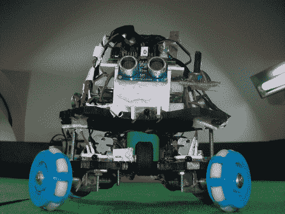

# 机器人足球机器人垂直放置轮子

> 原文：<https://hackaday.com/2010/02/21/robocup-bot-places-wheels-perpendicularly/>

[Eric] [为 2009 年机器人世界杯比赛](http://narobo.com/robots/soccer_robot/main.html)制造了这个机器人。游戏球内部有红外发光二极管，这个小机器人使用八个红外探测器进行跟踪。四个相互垂直安装的马达提供运动。因为这通常会让你绕圈旅行，他使用了一些全向轮壁 [Transwheels](http://www.omniwheel.com/transwheel/transwheel.htm) 。正如你所看到的，它们有内置的小滚轮，如果马达一起工作，可以向任何方向移动。一对 L298 控制器芯片处理电机。[Eric]编写了一个程序来计算驱动控制器和协调车轮运动所需的 PWM。

不要错过休息后的演示视频，如果你不喜欢轮子，停下来看看双踏板足球机器人。T3[https://www.youtube.com/embed/OtuZ2HUR2yI?version=3&rel=1&showsearch=0&showinfo=1&iv_load_policy=1&fs=1&hl=en-US&autohide=2&wmode=transparent](https://www.youtube.com/embed/OtuZ2HUR2yI?version=3&rel=1&showsearch=0&showinfo=1&iv_load_policy=1&fs=1&hl=en-US&autohide=2&wmode=transparent)

进攻

[https://www.youtube.com/embed/A8fyPCxXI7c?version=3&rel=1&showsearch=0&showinfo=1&iv_load_policy=1&fs=1&hl=en-US&autohide=2&wmode=transparent](https://www.youtube.com/embed/A8fyPCxXI7c?version=3&rel=1&showsearch=0&showinfo=1&iv_load_policy=1&fs=1&hl=en-US&autohide=2&wmode=transparent)

防卫