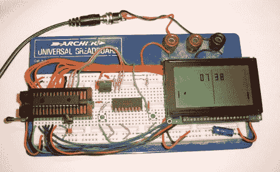

# PIC 乒乓时钟

> 原文：<https://hackaday.com/2010/02/22/pic-pong-clock/>

[Andrew]花了几天时间建造了这个乒乓时钟。他使用的 PIC 18f2520 可以作为一个实时时钟，外加一个外部时钟晶体。他的项目证明了示波器的实用性，因为糟糕的电路板布局会对晶体连接造成干扰，如果没有这个方便的实验室工具，很难排除故障。

[乓钟](http://hackaday.com/2008/09/14/pong-clock/)已经在[相当流行](http://hackaday.com/2009/09/28/pong-on-your-wrist/)。这个很好，因为它很容易组合在一起，因为[Andrew]已经为您完成了编码工作。如果您缺乏低级语言技能，阅读和理解他的代码可能是一个很好的练习。