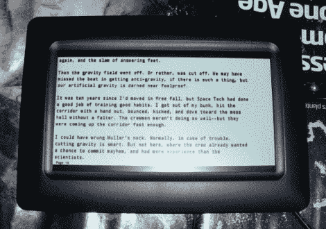

# 那是某种新的 Kindle 吗？

> 原文：<https://hackaday.com/2010/02/22/is-that-some-type-of-new-kindle/>



[C·卡马乔先生]拿起一个便宜的数码相框，希望能黑进去。他没有时间打开硬件，让它按照他的要求工作，但他确实找到了一种创造性的方法，让它成为电子书阅读器。他使用 python 脚本处理书籍，创建页面图像。

休息过后，python 脚本就可以使用了，它从古腾堡项目中获取免费书籍，并提供 JPG 的图片。翻页和书签不是它们应该的样子，但是这个过程确实有效。想到有人在地铁上盯着相框看有点好笑，但我们确信迟早有人会问这是不是新版的[Kindle](http://hackaday.com/2010/01/31/add-a-bluetooth-terminal-to-your-kindle/)。

开发商的用法说明:

> 。/process . py book . txt 480 234 16/usr/share/fonts/truetype/TTF-droid/droidsansmono . TTF 10 7
> 
> 参数
> 
> 1 book.txt 文件名
> 2 480 图片框的原生 X 分辨率
> 3 234 图片框的原生 Y 分辨率
> 4 16 所需文本的垂直行数
> 5 blah.ttf 完整路径和 ttf 字体名称
> 6 10 用于行的字体大小
> 7 页面底部“第 X 页”的字体大小
> 
> 你必须摆弄它，让它适合你的屏幕尺寸
> 
> (这只是一个黑客；首先要做的主要事情是屏幕宽度的字体大小
> 从这里你可以计算出你能容纳的行数…

```
#!/usr/bin/python

import pygameimport sys

# ./process.py book.txt 480 234 16 /usr/share/fonts/truetype/ttf-droid/DroidSansMono.ttf 10 7

txtname=sys.argv[1]nativeX=int(sys.argv[2])nativeY=int(sys.argv[3])pagelines=int(sys.argv[4])fontname=sys.argv[5]fontsize=int(sys.argv[6])pagenosize=int(sys.argv[7])

f=open(txtname)

def cleanline(l): l=l.strip('\r') l=l.strip('\n') return l

pygame.init()screen = pygame.display.set_mode((nativeX, nativeY))lines=f.readlines()font = pygame.font.Font(fontname, fontsize)pfont = pygame.font.Font(fontname, pagenosize)

for ln in range(len(lines)/pagelines+1): background = pygame.Surface(screen.get_size()) background = background.convert() background.fill((255, 255, 255))

 for pl in range(16): if (ln*16+pl)&lt;len(lines): line=cleanline(lines[ln*pagelines+pl]) text = font.render(line, 1, (0, 0, 0)) textpos = text.get_rect(x=4,y=pl*(nativeY/pagelines)) background.blit(text, textpos) text=pfont.render(&quot;Page &quot;+str(ln+1),1,(0,0,0)) textpos=text.get_rect(x=8,y=nativeY-pagenosize) background.blit(text,textpos) screen.blit(background, (0, 0)) pygame.display.flip() fn=&quot;page%#05d&quot; % (ln+1) pygame.image.save(background,fn+&quot;.jpg&quot;)

```