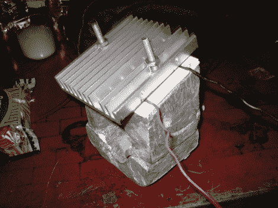

# DIY 铝制散热器铸件

> 原文：<https://hackaday.com/2010/02/23/diy-aluminum-heat-sink-casting/>

[Peter Wirasnik]一直在[铸造自己的铝制散热器](http://s905.photobucket.com/albums/ac256/pwirasnik/Casting%20Round%202/)。他正致力于捕捉汽车排气系统的热量并将其转化为电能，有点像蜡烛发电机的[。在上面的照片中，一个标准散热器用螺栓固定在 Peltier 冷却器的一侧，底部有[Peter]自己的铸件。该铸件将连接到排气管，并将热量传递到珀尔帖，而另一个散热器保持相对较冷。结果是电压在 600 毫伏和 1V 之间。](http://hackaday.com/2010/01/05/generate-electricity-with-a-candle/)

我们不太确定最终产品会是什么，但是铸造过程很吸引人。他用聚苯乙烯泡沫塑料雕刻出想要铸造的形状，并将其嵌入一盒沙子中。然后他用一个看起来像丙烷火炬的东西在铸铁煎锅里熔化回收的铝。一旦熔化，他将铝倒入模具，当它填充空隙时，会烧掉泡沫聚苯乙烯。稍微清理一下，他就找到了他想要的导热安装支架。