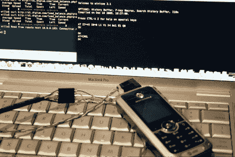

# 与手机的串行通信

> 原文：<https://hackaday.com/2010/02/23/serial-communication-with-cell-phones/>

Hackaday 校友(Will O'Brien)一直在做一些手机集成工作。他最近从易贝买了一些摩托罗拉 c168i 手机。原来有一个串行端口，使用 TTL 通信与标准耳机插孔作为接口。[威尔]焊接了一个连接器，并用 USB 转[FTDI](http://hackaday.com/2009/09/22/introduction-to-ftdi-bitbang-mode/)线与手机连接。令他惊讶的是，他能够读出存储的文本信息，即使它们在手机操作系统中受到 PIN 保护。这些设备上的信息微不足道，但这是在丢弃设备之前清除数据的重要性的另一个例子。