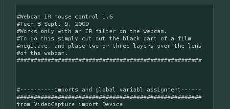

# 面向残疾人的 Python 红外跟踪

> 原文：<https://hackaday.com/2010/02/25/python-ir-tracking-for-the-handicapped/>

我有一个朋友在一次事故后瘫痪了，再也不能使用电脑。他用 python 搭建了一个惊人的简单鼠标界面来实现红外跟踪。控制器是在一顶旧帽子的基础上添加了一个红外 LED 和无线鼠标，这样用户就可以用嘴点击按钮了。使用曝光胶片作为过滤器的[网络摄像头](http://hackaday.com/2008/07/28/wiimoteless-ir-whiteboard/)可以跟踪红外 LED 并从无线鼠标按钮获取输入。

这种设置的灵感来自于 Wii 遥控白板，比眼写手 T2 简单得多(并且不会将红外 LED 灯照进你的眼睛)。虽然[Techb]希望将面部识别添加到系统中，但对于这样一个简单的实现，还是有话要说。

[谢谢沃尔夫曼·库德]