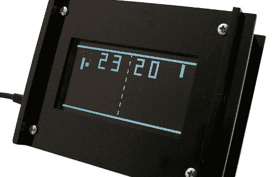

# 又一个乒乓钟

> 原文：<https://hackaday.com/2010/02/26/yet-another-pong-clock/>

让我们知道阿达果工业公司刚刚发布了一个乒乓时钟套件。80 美元的价格可能看起来有点高，但它确实配有定制的 KS0108 显示器，以便像经典视频游戏一样获得白底黑字，正如休息后看到的那样。还包括激光切割的情况下，一个 ATmega328 微控制器，RTC，和所有其他需要得到这个工作位。

我们刚刚看到一个 [pong 时钟建立在使用 KS0108 显示器的试验板](http://hackaday.com/2010/02/22/pic-pong-clock/)上，但那个使用 PIC 处理器。 [Adafruit](http://www.adafruit.com/) 总是开源他们的设计和代码，所以如果你手头已经有硬件来组装它们，你可以去[工具箱的详细页面](http://www.ladyada.net/make/monochron/)。

[https://player.vimeo.com/video/9749504](https://player.vimeo.com/video/9749504)